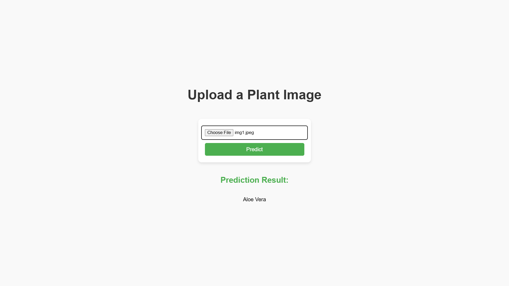

# Plant Classification Model Web App

This project is a **Flask-based web application** that uses a **PyTorch model** to classify plant images into one of ten predefined categories. It employs a pre-trained Vision Transformer (ViT) model fine-tuned for plant identification.

---
## Screenshots

- **Main Interface**:
  

---

## Features
- **Image Classification**: Classifies uploaded plant images into one of the following categories:
  - Aloe Vera
  - Areca Palm
  - Boston Fern
  - Chinese Evergreen
  - Dracaena
  - Money Tree
  - Peace Lily
  - Rubber Plant
  - Snake Plant
  - ZZ Plant
- **Confidence Score**: Calculates the confidence score for the predicted class.
- **Interactive Interface**: Simple web-based UI for uploading images and viewing predictions.

---

## Requirements
### Software
- Python 3.8 or above
- Flask
- PyTorch
- Transformers
- Torchvision
- PIL (Pillow)

### Install Dependencies
Install the required libraries using:
```bash
pip install flask torch torchvision transformers pillow
```

---

## Model
The model uses a fine-tuned Vision Transformer (ViT) from the Hugging Face Transformers library:
- **Pretrained Model**: `umutbozdag/plant-identity`
- **Framework**: PyTorch
- **Input Size**: Resized to 224x224 pixels
- **Normalization**: Standard ImageNet normalization.

---

## Usage

1. Clone the repository:
   ```bash
   git clone https://github.com/your-username/plant-classification.git
   cd plant-classification
   ```

2. Place the model weights (`model.pth`) in the root directory.

3. Start the Flask application:
   ```bash
   python app.py
   ```

4. Open your browser and navigate to:
   ```
   http://127.0.0.1:5000/
   ```

5. Upload a plant image to classify it.

---

## File Structure
- **app.py**: Main Flask application for handling requests and predictions.
- **templates/index.html**: Front-end page for uploading images and displaying results.
- **model.pth**: Saved PyTorch model weights (place in the root directory).
- **static/**: Folder for any static assets (e.g., CSS, images).

---

## Example Workflow
1. User uploads a plant image via the web interface.
2. The image is processed using PyTorch transforms:
   - Resized to 224x224 pixels.
   - Normalized with ImageNet mean and standard deviation.
3. The pre-trained ViT model predicts the plant category.
4. The predicted class is displayed on the web page.

---

## Notes
- Ensure the `model.pth` file matches the model architecture used in `app.py`.
- Use a CUDA-compatible GPU for faster inference, or the application will default to CPU.
- The class names are customizable if the model is retrained for additional plants.
